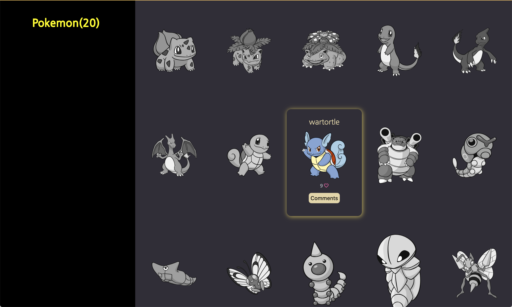

# Pokemon

This is an app that displays pokemons using a remote API.



This project shows pokemon characters.

## Built With

- HTML
- CSS
- Javascript
- webpack

## Live Demo

This project is deployed on a github page on the link below:

- https://matovu-farid.github.io/pokemon/

## Video Demo


## Getting Started

### Install

To get the content of this project locally you need to run this command in your terminal:

```
- git clone your https://github.com/matovu-farid/pokemon.git
- cd project pokemon
- npm install
- npm start
```

### Run tests

```
- npm test
```

## Author

👤 **Matovu Farid Nkoba**

- GitHub: [@matovu-farid](https://github.com/matovu-farid)
- Twitter: [@matovu100](https://twitter.com/matovu100)
- LinkedIn: [matovu-farid](https://www.linkedin.com/in/matovu-farid-48b80257)

👤 **JihaneH**

- GitHub: [@githubhandle](https://github.com/jihaneH)
- LinkedIn: [LinkedIn](https://www.linkedin.com/in/jihanne/)

## 📝 License

This project is [MIT](./MIT.md) licensed.
